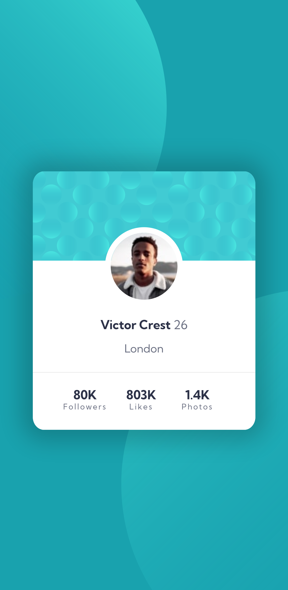

# Frontend Mentor - Profile card component solution

This is a solution to the [Profile card component challenge on Frontend Mentor](https://www.frontendmentor.io/challenges/profile-card-component-cfArpWshJ). Frontend Mentor challenges help you improve your coding skills by building realistic projects.

## Table of contents

- [Overview](#overview)
  - [The challenge](#the-challenge)
  - [Screenshot](#screenshot)
  - [Links](#links)
- [My process](#my-process)
  - [Built with](#built-with)
  - [What I learned](#what-i-learned)
  - [Continued development](#continued-development)
- [Author](#author)

## Overview

### The challenge

- Build out the project to the designs provided

### Screenshot

### Links

- Solution URL: [Add solution URL here](https://your-solution-url.com)
- Live Site URL: [Add live site URL here](https://your-live-site-url.com)

## My process

### Built with

- HTML
- CSS
- [React](https://reactjs.org/) - JS library

### What I learned

- Importing and displaying components with Reactjs
- Displaying content from an array within React

### Continued development

- Create a larger-scale Reactjs project
- Incorporate more images & dynamic elements

## Author

- Website - [Harmonia.codes](https://harmonia.codes)
- Frontend Mentor - [@yourusername](https://www.frontendmentor.io/profile/harmoniacodes)
- Mastodon - [@tech.lgbt@harmonia](https://www.twitter.com/yourusername)
